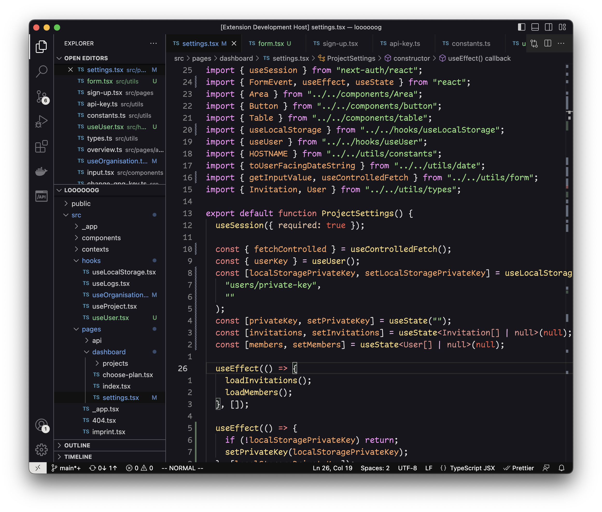

# October Theme

A warm VSCode dark theme. 🍂☕️

## Contributing

All contributions are welcome! Please refer to the [VSCode extension quickstart guide](vsc-extension-quickstart.md) to test your changes locally.
